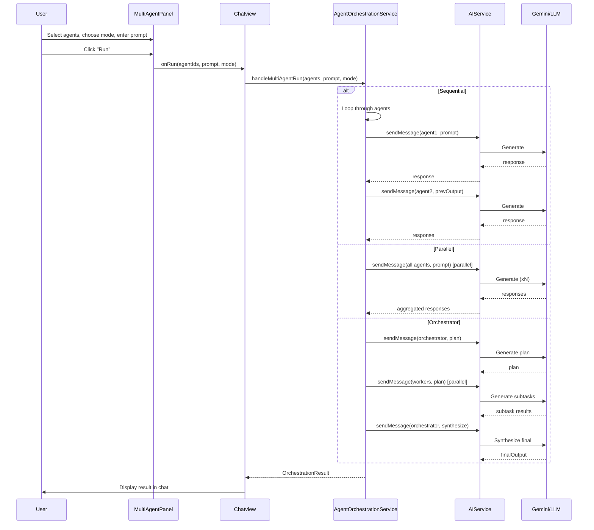
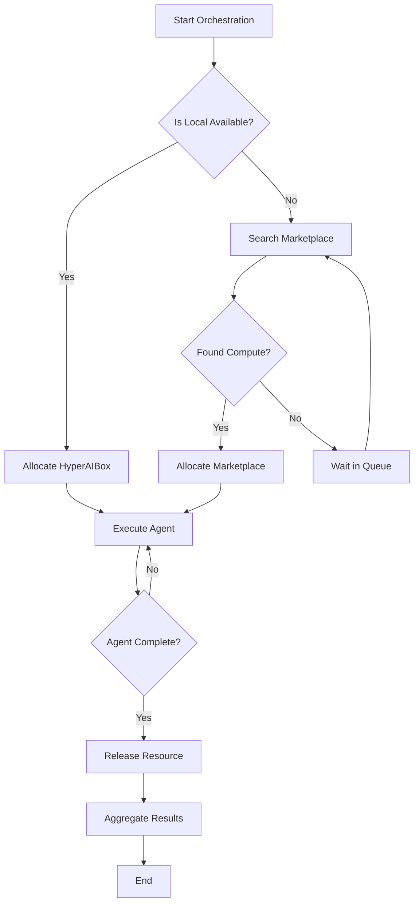

# Architecture Documentation

> Detailed technical documentation for the Multi-Agent Orchestration System

---

## Table of Contents

1. [System Overview](#system-overview)
2. [Multi-Agent Orchestration Model](#multi-agent-orchestration-model)
3. [Task Routing Between Agents](#task-routing-between-agents)
4. [Compute Resource Assignment](#compute-resource-assignment)
5. [Workload Tracking](#workload-tracking)
6. [Node Communication](#node-communication)
7. [Data Flow Diagrams](#data-flow-diagrams)

---

## System Overview

The Multi-Agent Orchestration System is a core component of Mosaic Companion that enables multiple AI agents to collaborate on complex tasks. It provides four distinct orchestration modes, each optimized for different workflow patterns.

### Key Design Principles

1. **Modularity** - Each agent is independent and can be configured separately
2. **Scalability** - Support for local (HyperAIBox) and remote (marketplace) compute
3. **Flexibility** - Multiple aggregation strategies for results
4. **Observability** - Built-in callbacks for monitoring and progress tracking

---

## Multi-Agent Orchestration Model

### Orchestration Modes

#### 1. Sequential Mode (Pipeline)

```
┌─────────┐    output    ┌─────────┐    output    ┌─────────┐
│ Agent 1 │ ──────────▶  │ Agent 2 │ ──────────▶  │ Agent 3 │
└─────────┘              └─────────┘              └─────────┘
    │                        │                        │
    ▼                        ▼                        ▼
Input: prompt          Input: prev output       Input: prev output
Output: result         Output: result           Output: final result
```

**Best for:** Code review pipelines, data transformation chains, multi-step analysis

**Implementation:** `AgentOrchestrationService.runSequential()`

```typescript
// Each agent receives the output of the previous agent
for (const agent of agents) {
  const response = await AIService.sendMessage(agent, messages);
  currentInput = response;  // Pass to next agent
}
```

#### 2. Parallel Mode (Fan-out)

```
         ┌─────────┐
         │ Agent 1 │
         └────┬────┘
              │
    ┌─────────┼─────────┐
    ▼         ▼         ▼
┌─────────┐ ┌─────────┐ ┌─────────┐
│ Agent 2 │ │ Agent 3 │ │ Agent 4 │
└────┬────┘ └────┬────┘ └────┬────┘
     └─────────┬─┴──────────┘
                │
                ▼
         ┌─────────────┐
         │ Aggregation │
         └─────────────┘
```

**Best for:** Research tasks, gathering multiple perspectives, independent subtasks

**Implementation:** `AgentOrchestrationService.runParallel()`

```typescript
// All agents run simultaneously
const results = await Promise.all(
  agents.map(agent => AIService.sendMessage(agent, messages))
);
```

#### 3. Collaborative Mode (Iteration)

```
┌──────────────────────────────────────────────────────────────┐
│                      Iteration 1                             │
│  ┌─────────┐                                                 │
│  │ Agent 1 │ ──▶ (improved content) ──▶                     │
│  └─────────┘                                                 │
│       │                                                      │
│       ▼                                                      │
│  ┌─────────┐                                                 │
│  │ Agent 2 │ ──▶ (improved content) ──▶  ... Iteration N   │
│  └─────────┘                                                 │
│       │                                                      │
│       ▼                                                      │
│  ┌─────────┐                                                 │
│  │ Agent 3 │ ──▶ (final result)                             │
│  └─────────┘                                                 │
└──────────────────────────────────────────────────────────────┘
```

**Best for:** Brainstorming, creative iteration, quality improvement loops

**Implementation:** `AgentOrchestrationService.runCollaborative()`

```typescript
// Agents iterate on each other's work
for (let iteration = 0; iteration < maxIterations; iteration++) {
  for (const agent of agents) {
    const response = await AIService.sendMessage(agent, [
      { role: 'user', content: `Previous: ${currentContent}\n\nImprove:` }
    ]);
    currentContent = response;
  }
}
```

#### 4. Orchestrator Mode (Coordinator)

```
┌─────────────────────────────────────────────────────────────┐
│                    ORCHESTRATOR PATTERN                     │
└─────────────────────────────────────────────────────────────┘

                          ┌───────────────┐
                          │  Orchestrator │
                          │   (Planner)   │
                          └───────┬───────┘
                                  │ creates plan
                                  ▼
        ┌─────────────────────────────────────────────────┐
        │                 WORKERS                         │
        │  ┌─────────┐   ┌─────────┐   ┌─────────┐    │
        │  │ Worker1 │   │ Worker2 │   │ Worker3 │    │
        │  └────┬────┘   └────┬────┘   └────┬────┘    │
        └──────┼──────────────┼──────────────┼─────────┘
               │              │              │
               └──────────────┼──────────────┘
                              ▼
                    ┌───────────────┐
                    │  Synthesize   │
                    │  (Finalize)   │
                    └───────────────┘
```

**Best for:** Complex projects requiring planning, task distribution, and synthesis

**Implementation:** `AgentOrchestrationService.runOrchestrated()`

```typescript
// 1. Orchestrator creates plan
const plan = await AIService.sendMessage(orchestrator, [
  { role: 'user', content: `Task: ${prompt}\nCreate a plan.` }
]);

// 2. Workers execute subtasks
const workerResults = await Promise.all(
  workers.map(worker => 
    AIService.sendMessage(worker, [
      { role: 'user', content: `Task: ${prompt}\nPlan: ${plan}` }
    ])
  )
);

// 3. Orchestrator synthesizes
const finalOutput = await AIService.sendMessage(orchestrator, [
  { role: 'user', content: `Results: ${workerResults.join('\n\n')}\nSynthesize:` }
]);
```

---

## Task Routing Between Agents

### Agent Selection

```typescript
// Agents are selected by ID in MultiAgentPanel
interface Agent {
  id: string;           // Unique identifier
  name: string;         // Display name
  role?: string;        // Agent role/description
  status?: AgentStatus; // Current status
  model?: string;       // AI model to use
}

type AgentStatus = 'idle' | 'ready' | 'running' | 'done' | 'error';
```

### Message Routing

```typescript
// Sequential: Each agent receives context from previous
const messages = [
  // Previous agent's output becomes context
  { role: 'assistant', content: `Previous agent output:\n${prevResponse}` },
  { role: 'user', content: currentInput }
];

// Parallel: All agents receive identical prompt
const messages = [
  { role: 'user', content: prompt }  // Same for all
];

// Orchestrator: Planner → Workers → Synthesizer
```

### Result Routing

| Mode | Routing Strategy |
|------|-----------------|
| Sequential | Output of N passed to N+1 |
| Parallel | Promise.all() - all complete before aggregation |
| Collaborative | Cyclic: each iteration passes to next agent |
| Orchestrator | Coordinator aggregates all worker results |

---

## Compute Resource Assignment

### Local Compute (HyperAIBox)

```typescript
// electron/integrations/hypercycle/config.ts
interface HyperAIBoxConfig {
  endpoint: string;        // e.g., http://localhost:8080
  apiKey?: string;
  maxConcurrent: number;   // Parallel agent limit
  timeout: number;         // Request timeout (ms)
}

const hyperboxConfig: HyperAIBoxConfig = {
  endpoint: process.env.HYPERBOX_ENDPOINT || 'http://localhost:8080',
  maxConcurrent: 5,
  timeout: 30000,
};
```

### Compute Marketplace

```typescript
// electron/integrations/hypercycle/marketplace.ts
interface ComputeListing {
  id: string;
  provider: string;
  capabilities: string[];   // ['llm', 'embedding', 'tts']
  pricePerToken: number;
  reputation: number;      // 0-1
  status: 'available' | 'busy';
}

class ComputeMarketplace {
  async findCompute(
    requirements: string[]
  ): Promise<ComputeListing[]> {
    // Find available compute matching requirements
    const listings = await fetch(
      `https://compute.hypercycle.ai/list?capabilities=${requirements.join(',')}`
    );
    return listings.json();
  }
  
  async allocateCompute(listingId: string): Promise<Allocation> {
    // Reserve compute resources
  }
}
```

### Resource Allocation Strategy

```typescript
// Priority-based allocation
const allocateResources = async (
  agents: AIAgentConfig[],
  mode: OrchestrationMode
): Promise<ResourceAllocation[]> => {
  const allocations: ResourceAllocation[] = [];
  
  for (const agent of agents) {
    // Check local HyperAIBox first
    const localNode = await nodeRegistry.findAvailable(
      agent.capabilities || ['llm']
    );
    
    if (localNode) {
      allocations.push({
        agent,
        node: localNode,
        priority: 'local'
      });
      continue;
    }
    
    // Fall back to marketplace
    const marketplaceNode = await marketplace.findCompute(
      agent.capabilities || ['llm']
    );
    
    if (marketplaceNode) {
      allocations.push({
        agent,
        node: marketplaceNode,
        priority: 'marketplace'
      });
    }
  }
  
  return allocations;
};
```

---

## Workload Tracking

### Orchestration Callbacks

```typescript
interface OrchestrationCallbacks {
  // Called when an agent starts processing
  onAgentStart?: (
    agentId: string,
    agentName: string,
    order: number,      // Current agent number
    total: number       // Total agents
  ) => void;
  
  // Called for each token received (streaming)
  onAgentProgress?: (
    agentId: string,
    token: string
  ) => void;
  
  // Called when an agent completes
  onAgentComplete?: (
    agentId: string,
    response: string,
    duration: number    // Time in ms
  ) => void;
  
  // Called when an agent fails
  onAgentError?: (
    agentId: string,
    error: string
  ) => void;
  
  // Called when all agents complete
  onAllComplete?: (
    result: OrchestrationResult
  ) => void;
}
```

### Workload Metrics

```typescript
interface WorkloadMetrics {
  taskId: string;
  mode: OrchestrationMode;
  startTime: number;
  endTime?: number;
  
  agents: {
    agentId: string;
    agentName: string;
    startTime: number;
    endTime?: number;
    tokensGenerated?: number;
    error?: string;
  }[];
  
  totalDuration: number;
  success: boolean;
}

// Track metrics
const trackMetrics = (
  agents: AIAgentConfig[],
  mode: OrchestrationMode
): WorkloadMetrics => ({
  taskId: `task-${Date.now()}`,
  mode,
  startTime: Date.now(),
  agents: agents.map(a => ({
    agentId: a.id,
    agentName: a.name,
    startTime: Date.now(),
  }))
});
```

---

## Node Communication

### HyperAIBox Communication

```
┌─────────────────┐         ┌─────────────────┐
│ MosaicCompanion │         │  HyperAIBox     │
│                 │         │                 │
│  ┌───────────┐  │   HTTP  │  ┌───────────┐ │
│  │   HTTP    │─ ──────────▶│  │  LLM API  │ │
│  │   Client  │  │         │  └───────────┘ │
│  └───────────┘  │         │                 │
└─────────────────┘         └─────────────────┘
```

```typescript
// electron/integrations/hypercycle/client.ts
export class HyperAIBoxClient {
  private endpoint: string;
  private apiKey?: string;
  
  async sendMessage(
    model: string,
    messages: ChatMessage[],
    options?: GenerateOptions
  ): Promise<GenerateResponse> {
    const response = await fetch(`${this.endpoint}/v1/generate`, {
      method: 'POST',
      headers: {
        'Content-Type': 'application/json',
        'Authorization': `Bearer ${this.apiKey}`,
      },
      body: JSON.stringify({
        model,
        messages: messages.map(m => ({
          role: m.role,
          content: m.content,
        })),
        temperature: options?.temperature,
        max_tokens: options?.maxTokens,
        stream: options?.stream || false,
      }),
    });
    
    return response.json();
  }
}
```

### ANFE Integration

```
┌─────────────────┐         ┌─────────────────┐
│ MosaicCompanion │         │     ANFE        │
│                 │         │  (Neural Forge) │
│  ┌───────────┐  │   HTTP  │  ┌───────────┐ │
│  │   HTTP    │─ ──────────▶│  │ Embedding │ │
│  │   Client  │  │         │  │   API     │ │
│  └───────────┘  │         │  └───────────┘ │
└─────────────────┘         └─────────────────┘
```

```typescript
// For embedding generation
export class ANFEClient {
  async generateEmbedding(
    text: string,
    model: string = 'nomic-embed'
  ): Promise<number[]> {
    const response = await fetch(`${this.endpoint}/v1/embed`, {
      method: 'POST',
      headers: { 'Content-Type': 'application/json' },
      body: JSON.stringify({ text, model }),
    });
    
    const result = await response.json();
    return result.embedding;
  }
}
```

---

## Data Flow Diagrams

### Complete Multi-Agent Flow



### Resource Allocation Flow



---

## Performance Considerations

### Concurrency Limits

```typescript
const MAX_PARALLEL_AGENTS = 5;
const AGENT_TIMEOUT_MS = 60000;
const RETRY_ATTEMPTS = 3;
```

### Optimization Strategies

1. **Connection Pooling** - Reuse HTTP connections for agents
2. **Streaming** - Process tokens as they arrive
3. **Caching** - Cache agent responses for identical prompts
4. **Load Balancing** - Distribute across multiple HyperAIBox instances

---

## Security Considerations

1. **API Key Management** - Keys stored in secure vault, not in code
2. **Sandboxing** - Agents run in isolated environments
3. **Input Validation** - Sanitize prompts before sending to agents
4. **Rate Limiting** - Prevent abuse of compute resources

---

## Related Documentation

- [Integration Guide](INTEGRATION_GUIDE.md)
- [API Reference](README.md#api-reference)
- [Troubleshooting](README.md#troubleshooting)
- [GitHub Repository](https://github.com/hypercycle-development/mosaic-companion)