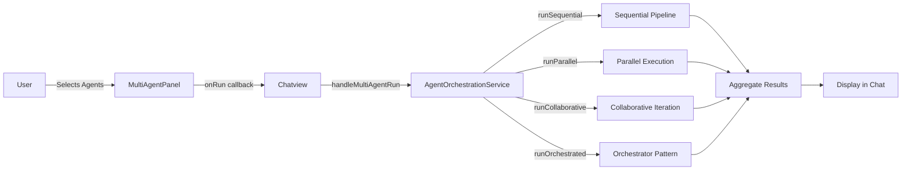

# Mosaic Companion - Multi-Agent Orchestration System

<p align="center">
  
</p>

> 🤖 **Enterprise-Grade Multi-Agent AI Orchestration** - Built for the HyperCycle ecosystem

Mosaic Companion is a sophisticated multi-agent AI orchestration system that enables multiple AI agents to collaborate on complex tasks. Built with TypeScript, React, and Electron.

---

## 📋 Table of Contents

1. [Architecture Overview](#architecture-overview)
2. [Key Features](#key-features)
3. [How It Works](#how-it-works)
4. [Installation](#installation)
5. [Environment Setup](#environment-setup)
6. [Running the System](#running-the-system)
7. [Adding a New Agent](#adding-a-new-agent)
8. [Integration Guide](#integration-guide)
9. [API Reference](#api-reference)
10. [Troubleshooting](#troubleshooting)
11. [Future Improvements](#future-improvements)

---

## 🏗️ Architecture Overview

```
┌─────────────────────────────────────────────────────────────────────────────┐
│                          MOSAIC COMPANION ARCHITECTURE                      │
└─────────────────────────────────────────────────────────────────────────────┘

                              ┌──────────────────┐
                              │   User Interface │
                              │  (MultiAgentPanel) │
                              └────────┬─────────┘
                                       │ onRun(agentIds, prompt, mode)
                                       ▼
                         ┌────────────────────────┐
                         │   Chatview.tsx         │
                         │  handleMultiAgentRun() │
                         └────────┬───────────────┘
                                  │
                                  ▼
                    ┌─────────────────────────────┐
                    │  AgentOrchestrationService │
                    └─────────────┬───────────────┘
                                  │
        ┌─────────────────────────┼─────────────────────────┐
        │                         │                         │
        ▼                         ▼                         ▼
┌───────────────┐      ┌───────────────────┐      ┌─────────────────┐
│   SEQUENTIAL │      │     PARALLEL      │      │  ORCHESTRATOR   │
│ Agent 1      │      │  ┌───────────┐   │      │                 │
│     ↓        │      │  │  Agent 1  │   │      │  ┌───────────┐  │
│ Agent 2      │      │  │  Agent 2  │   │      │  │Orchestrator│  │
│     ↓        │      │  │  Agent 3  │   │      │  │    ↓       │  │
│ Agent 3      │      │  └───────────┘   │      │  │  Workers   │  │
│ (Pipeline)   │      │  (All at once)    │      │  │    ↓       │  │
└───────────────┘      └───────────────────┘      │ Synthesize   │
                                                    └─────────────┘
```

### Core Components

| Component | Responsibility | Location |
|-----------|---------------|----------|
| **MultiAgentPanel** | UI for agent selection, mode picker, prompt input | `src/components/MultiAgentPanel.tsx` |
| **AgentOrchestrationService** | Orchestration logic engine | `src/services/AgentOrchestrationService.ts` |
| **AIService** | Core AI communication with LLM providers | `src/services/AIService.ts` |
| **MultiAgentService** | State management | `src/services/MultiAgentService.ts` |
| **Chatview** | Integration point, handles callbacks | `src/components/Chatview.tsx` |

---

## ✨ Key Features

### 🎯 Orchestration Modes

| Mode | Description | Use Case |
|------|-------------|----------|
| **Sequential** | Agent 1 → output → Agent 2 → output → Agent 3 | Pipeline workflows, code review |
| **Parallel** | All agents run simultaneously | Research, gathering multiple perspectives |
| **Collaborative** | Agents iterate together | Brainstorming, iterative refinement |
| **Orchestrator** | Lead agent coordinates others | Complex projects with planning phase |

### 🔧 Built-in Templates

| Template | Mode | Description |
|----------|------|-------------|
| `codeReview` | Sequential | Write → Review → Refine |
| `research` | Parallel | Multi-perspective research |
| `brainstorm` | Collaborative | Creative iteration |
| `debate` | Orchestrator | Debate → Synthesis |

### 🌐 Supported Integrations

- **HyperAIBox** - Local AI compute nodes
- **Ethereum** - Blockchain interactions
- **ANFE** - Neural forge compute
- **Gmail** - Email automation
- **Vault** - Secure credential storage

---

## 🔄 How It Works

### Step-by-Step Flow

```
1. USER ACTION
   └── Select agents in MultiAgentPanel
   └── Choose orchestration mode
   └── Enter prompt/task description
   └── Click "Run"

2. UI HANDLER (Chatview.tsx)
   └── handleMultiAgentRun() receives callback
   └── Filters selected agents from config
   └── Calls AgentOrchestrationService

3. ORCHESTRATION ENGINE
   ├── Sequential: Loop agents, pass output to next
   ├── Parallel: Promise.all() all agents
   ├── Collaborative: Iterate with maxIterations
   └── Orchestrator: Coordinator → Workers → Synthesize

4. RESULT AGGREGATION
   ├── lastWins: Take last agent's response
   ├── concatenate: Combine all responses
   ├── synthesize: Let orchestrator summarize
   └── vote: Take first response

5. DISPLAY
   └── Add response to chat history
   └── Show status in UI
```

### Data Flow Diagram



---

## 📦 Installation

### Prerequisites

| Requirement | Version | Notes |
|-------------|---------|-------|
| Node.js | v20+ | LTS recommended |
| npm | 9+ | Comes with Node.js |
| Git | 2.x | For version control |

### Quick Install

```bash
# Clone the repository
git clone https://github.com/hypercycle-development/mosaic-companion.git
cd mosaic-companion

# Install dependencies
npm install

# Or use the setup script
./setup.sh
```

### Development Setup

```bash
# Start development server with hot reload
npm run dev

# Build for production
npm run build

# Run Electron app
npm start
```

---

## 🔐 Environment Setup

### Required Variables

Create a `.env.local` file in the project root:

```bash
# ===================
# AI Configuration
# ===================

# Google Gemini API (required for AI features)
GEMINI_API_KEY=your_gemini_api_key_here

# Optional: Override default model
# GEMINI_MODEL=gemini-2.0-flash-exp

# ===================
# HyperCycle Integration
# ===================

# HyperAIBox endpoint (for local compute)
HYPERBOX_ENDPOINT=http://localhost:8080

# Ethereum RPC (for Web3 features)
ETHEREUM_RPC=https://mainnet.infura.io/v3/your_project_id

# ===================
# Optional Features
# ===================

# Gmail OAuth (see docs/GMAIL_SETUP.md)
# GMAIL_CLIENT_ID=your_client_id
# GMAIL_CLIENT_SECRET=your_client_secret

# Logging
# LOG_LEVEL=debug
```

### Advanced Configuration

For production deployments, see `docs/build.md` for:
- Building for Windows/macOS/Linux
- S3 deployment configuration
- Code signing setup

---

## 🚀 Running the System

### Development Mode

```bash
# Start with hot reload
npm run dev

# App will open at http://localhost:5173
```

### Production Build

```bash
# Build the app
npm run build

# Run the Electron app
npm start
```

### Platform-Specific Builds

```bash
# Windows
npm run make:win

# macOS
npm run make:mac

# Linux
npm run make:linux
```

---

## 🤖 Adding a New Agent

### Step 1: Define Agent Config

In `src/types/ai.ts`:

```typescript
export interface AIAgentConfig {
  id: string;
  name: string;
  description: string;
  model: string;
  systemPrompt?: string;
  temperature?: number;
  maxTokens?: number;
  isActive?: boolean;
  // Add custom fields
  capabilities?: string[];
}
```

### Step 2: Register Agent

In your settings or database, add the agent:

```typescript
const newAgent: AIAgentConfig = {
  id: 'my-agent',
  name: 'My Custom Agent',
  description: 'Specializes in data analysis',
  model: 'gemini-2.0-flash-exp',
  systemPrompt: 'You are a data analysis expert...',
  temperature: 0.7,
  isActive: true,
};
```

### Step 3: Use in Multi-Agent Panel

The agent will automatically appear in the MultiAgentPanel when:
- `agents` prop is passed to MultiAgentPanel, OR
- Agents are loaded from the API via `window.electronAPI.aiAgents.get()`

---

## 🔌 Integration Guide

### Integrating into Existing App

#### 1. Install Dependencies

```bash
npm install lucide-react
```

#### 2. Import Components

```typescript
import { MultiAgentPanel, toPanelAgent } from './components/MultiAgentPanel';
import { AgentOrchestrationService } from './services/AgentOrchestrationService';
import { Users } from 'lucide-react';
```

#### 3. Add UI Components

```tsx
// In your main chat component
const [showMultiAgentPanel, setShowMultiAgentPanel] = useState(false);
const [agents, setAgents] = useState<AIAgentConfig[]>([]);

// Toggle button (in your toolbar)
<button
  onClick={() => setShowMultiAgentPanel(!showMultiAgentPanel)}
  className="p-2 rounded-lg"
>
  <Users size={18} />
</button>

// Panel (above input area)
{showMultiAgentPanel && (
  <MultiAgentPanel
    agents={agents.map(toPanelAgent)}
    onCollapse={() => setShowMultiAgentPanel(false)}
    onRun={handleMultiAgentRun}
  />
)}
```

#### 4. Handle Execution

```tsx
const handleMultiAgentRun = async (
  agentIds: string[],
  prompt: string,
  mode: OrchestrationMode
) => {
  const selectedAgents = agents.filter(a => agentIds.includes(a.id));

  const result = await AgentOrchestrationService[
    mode === 'sequential' ? 'runSequential' :
    mode === 'parallel' ? 'runParallel' :
    mode === 'collaborative' ? 'runCollaborative' :
    'runParallel'
  ](selectedAgents, prompt);

  // Handle result...
  console.log('Final output:', result.finalOutput);
};
```

### Connecting HyperCycle Nodes

#### HyperAIBox Integration

```typescript
// In electron/integrations/hypercycle/config.ts
export const hypercycleConfig = {
  // Local HyperAIBox node
  hyperbox: {
    endpoint: process.env.HYPERBOX_ENDPOINT || 'http://localhost:8080',
    apiKey: process.env.HYPERBOX_API_KEY,
  },
  
  // Compute marketplace
  marketplace: {
    enabled: true,
    minReputation: 0.8,
    pricingEndpoint: 'https://compute.hypercycle.ai/pricing',
  },
};
```

#### Adding Node Types

```typescript
// electron/integrations/hypercycle/nodes.ts
export interface HyperCycleNode {
  id: string;
  type: 'hyperbox' | 'anfe' | 'ethereum';
  endpoint: string;
  status: 'available' | 'busy' | 'offline';
  capabilities: string[];
}

export class NodeRegistry {
  private nodes: Map<string, HyperCycleNode> = new Map();

  register(node: HyperCycleNode) {
    this.nodes.set(node.id, node);
  }

  findAvailable(capabilities: string[]): HyperCycleNode | null {
    for (const node of this.nodes.values()) {
      if (node.status === 'available' && 
          capabilities.every(c => node.capabilities.includes(c))) {
        return node;
      }
    }
    return null;
  }
}
```

### Exposing Compute to Marketplace

```typescript
// electron/integrations/hypercycle/marketplace.ts
export class ComputeMarketplace {
  async registerCompute(
    capabilities: string[],
    pricing: ComputePricing
  ): Promise<string> {
    // Register this node as available for compute
    const response = await fetch('https://compute.hypercycle.ai/register', {
      method: 'POST',
      headers: {
        'Content-Type': 'application/json',
        'Authorization': `Bearer ${process.env.HYPERBOX_API_KEY}`,
      },
      body: JSON.stringify({
        capabilities,
        pricing,
        endpoint: process.env.HYPERBOX_ENDPOINT,
      }),
    });
    
    return response.json();
  }
  
  async getWorkloadStatus(workloadId: string): Promise<WorkloadStatus> {
    // Monitor active workloads
    const response = await fetch(
      `https://compute.hypercycle.ai/workloads/${workloadId}`,
      {
        headers: {
          'Authorization': `Bearer ${process.env.HYPERBOX_API_KEY}`,
        },
      }
    );
    
    return response.json();
  }
}
```

---

## 📚 API Reference

### MultiAgentPanel Props

```typescript
interface MultiAgentPanelProps {
  // Pre-loaded agents (optional - will load from API if not provided)
  agents?: Agent[];
  
  // Pre-selected agent IDs
  initialSelected?: string[];
  
  // Called when user clicks Run
  onRun: (agentIds: string[], prompt: string, mode: OrchestrationMode) => void;
  
  // Called to collapse panel (after run)
  onCollapse?: () => void;
}
```

### Agent Type

```typescript
interface Agent {
  id: string;
  name: string;
  role?: string;
  status?: 'idle' | 'ready' | 'running' | 'done' | 'error';
  model?: string;
}
```

### OrchestrationMode

```typescript
type OrchestrationMode = 
  | 'sequential'    // Agent 1 → Agent 2 → Agent 3
  | 'parallel'      // All agents simultaneously
  | 'collaborative' // Agents iterate together
  | 'orchestrator'; // Lead agent coordinates
```

### AgentOrchestrationService Methods

```typescript
class AgentOrchestrationService {
  // Pipeline: each agent receives previous output
  static runSequential(
    agents: AIAgentConfig[], 
    prompt: string,
    callbacks?: OrchestrationCallbacks
  ): Promise<OrchestrationResult>

  // Parallel: all agents run simultaneously
  static runParallel(
    agents: AIAgentConfig[], 
    prompt: string,
    callbacks?: OrchestrationCallbacks
  ): Promise<OrchestrationResult>

  // Collaborative: agents iterate on each other's work
  static runCollaborative(
    agents: AIAgentConfig[], 
    prompt: string,
    maxIterations?: number,
    callbacks?: OrchestrationCallbacks
  ): Promise<OrchestrationResult>

  // Orchestrator: lead agent coordinates workers
  static runOrchestrated(
    orchestrator: AIAgentConfig,
    workers: AIAgentConfig[],
    prompt: string,
    callbacks?: OrchestrationCallbacks
  ): Promise<OrchestrationResult>
}
```

### OrchestrationResult

```typescript
interface OrchestrationResult {
  taskId: string;
  responses: AgentResponse[];
  finalOutput: string;
  totalDuration: number;
  mode: OrchestrationMode;
  aggregationStrategy: AggregationStrategy;
  success: boolean;
}

interface AgentResponse {
  agentId: string;
  agentName: string;
  response: string;
  timestamp: number;
  duration: number;
  error?: string;
}
```

### AggregationStrategy

```typescript
type AggregationStrategy = 
  | 'lastWins'      // Last agent's response wins
  | 'concatenate'   // Combine all responses
  | 'synthesize'    // Orchestrator synthesizes
  | 'vote';         // First response wins
```

---

## 🔧 Troubleshooting

### Common Issues

#### 1. "No agents available"

**Solution:** Ensure agents are configured in settings or passed via `agents` prop.

```tsx
<MultiAgentPanel
  agents={[
    { id: 'agent-1', name: 'Agent 1', role: 'Helper', status: 'ready' },
  ]}
  // ...
/>
```

#### 2. "API key not set"

**Solution:** Set `GEMINI_API_KEY` in `.env.local`

```bash
echo "GEMINI_API_KEY=your_key" > .env.local
```

#### 3. "Electron app exits immediately"

**Solution:** The app is likely running in the background. Check system tray or use:

```powershell
Get-Process -Name "electron"
```

#### 4. "Parallel agents timeout"

**Solution:** Increase timeout in callbacks:

```typescript
const result = await AgentOrchestrationService.runParallel(agents, prompt, {
  onAgentStart: (...),
  onAgentComplete: (...),
  // Add timeout handling
});
```

### Debug Logging

Enable debug mode:

```bash
# In .env.local
LOG_LEVEL=debug
```

Or add console logs:

```typescript
console.log('[Multi-Agent] Starting orchestration:', { agentIds, mode });
```

---

## 🚦 Future Improvements

### Planned Features

| Feature | Status | Description |
|---------|--------|-------------|
| **HyperCycle Compute** | 🚧 In Progress | Integrate with HyperCycle compute marketplace |
| **Real-time Collaboration** | 📋 Planned | WebSocket-based agent communication |
| **Agent Templates** | 📋 Planned | Shareable agent configurations |
| **Performance Metrics** | 📋 Planned | Workload tracking and optimization |
| **Multi-node Orchestration** | 📋 Planned | Distribute agents across HyperAIBox nodes |

### Contributing

1. Fork the repository
2. Create a feature branch (`git checkout -b feature/amazing-feature`)
3. Commit your changes (`git commit -m 'Add amazing feature'`)
4. Push to the branch (`git push origin feature/amazing-feature`)
5. Open a Pull Request

---

## 📄 License

MIT License - See [LICENSE](LICENSE) for details.

---

## 🆘 Support

- **Documentation:** [docs/](docs/)
- **Issues:** [GitHub Issues](https://github.com/hypercycle-development/mosaic-companion/issues)
- **Discord:** [HyperCycle Discord](https://discord.com/invite/hypercycle)

---

<p align="center">
  <strong>Built with ❤️ for the HyperCycle Ecosystem</strong>
</p>